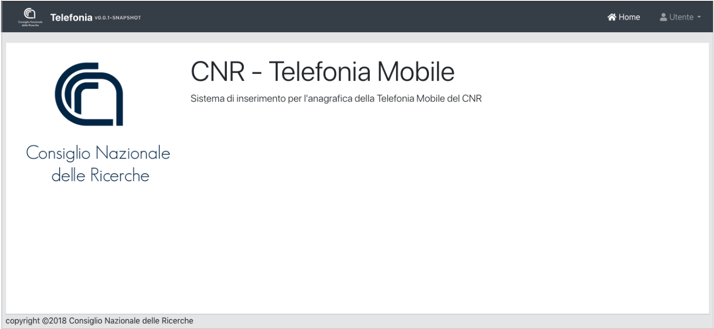

================================
Procedura Telefonia Mobile
================================
Sistema per l’inserimento delle utenze della Telefonia Mobile CNR

   	Schermata principale

https://telefoniamobile.cnr.it

.. sectionauthor::  Valerio Diego valerio.diego@cnr.it
.. sectionauthor::  Marco Spasiano marco.spasiano@cnr.it
.. sectionauthor::  Ufficio Ragioneria e Affari Fiscali segreteria.uraf@cnr.it

**GESTIONE UTENZA**

Per tale procedura verranno gestite centralmente due tipologie di utenze:

- DIRETTORE ad uso esclusivo del Direttore/Dirigente/Responsabile della struttura
- UTENTE abilitato all'inserimento collegato con l’utenza del Segretario Amministrativo.

.. toctree::
  :numbered:
  :caption: Indice dei contenuti

  accesso_applicativo
  telefono
  telefono_operatore
  telefono_servizi
  telefono_validazione
