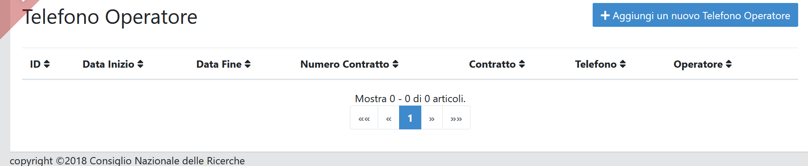
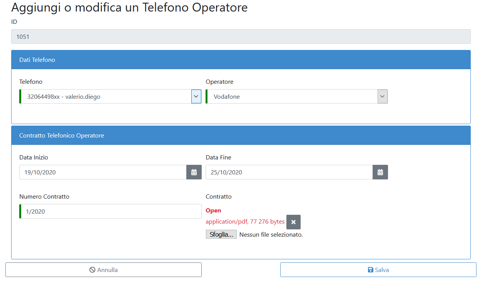
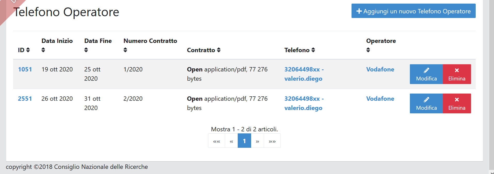

TELEFONO OPERATORE
==================

Dopo aver cliccato su Telefono Operatoreè possibile visualizzare ed inserire
l’operatore del telefono e modificare l’operatore del telefono mobile :numref:`lista_telefoni_operatore`.

.. _lista_telefoni_operatore:

   	Lista Telefoni Operatore

Per inserire un nuovo telefono operatore si dovrà cliccare su “Aggiungi un nuovo Telefono Operatore”
selezionando dalla lista degli operatori l’operatore mobile di quel telefono e in Telefono Operatore
si seleziona dal menu a tendina il numero a cui è associato quell’operatore.

Si inserisce il numero di Contratto con in allegato il contratto con l’operatore e si clicca salva (Esempio in :numref:`crea_telefono_operatore`).

.. warning::

    Per poter compilare la pagina occorre aver inserito almeno il Telefono.

.. _crea_telefono_operatore:

   	Crea Telefono Operatore

Dopo aver premuto il tasto salva si avrà la possibilità di visualizzare la lista dei Contratti con associato il nome dell’operatore (:numref:`lista_telefoni_operatore2`).

.. _lista_telefoni_operatore2:

   	Lista Telefoni Operatore presenti
