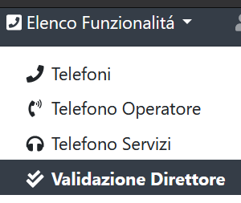

VALIDAZIONE TELEFONO
====================

.. warning::

     Solo il *Direttore/Dirigente/Responsabile* potrà accedere alla sezione.

Nel menu a tendina dopo essersi autenticati in Elenco funzionalità vi troverete la voce Validazione Direttore (:numref:`validazione_menu`):

.. _validazione_menu:

   	Menu Validazione Telefono

Il Direttore/dirigente/responsabile accede alla sezione “Validazione” dal menù Funzionalità del programma.
All’interno troverà l’elenco di tutte le attività svolte dalla Struttura con riferimento alla telefonia mobile che potrà visualizzare e, in caso di riscontro positivo, validare.

Cliccando sul tasto “Valida” (:numref:`validazione`) il Direttore/Dirigente/Responsabile può procedere alla validazione dell’operazione.

.. _validazione:

   	Validazione Telefono
